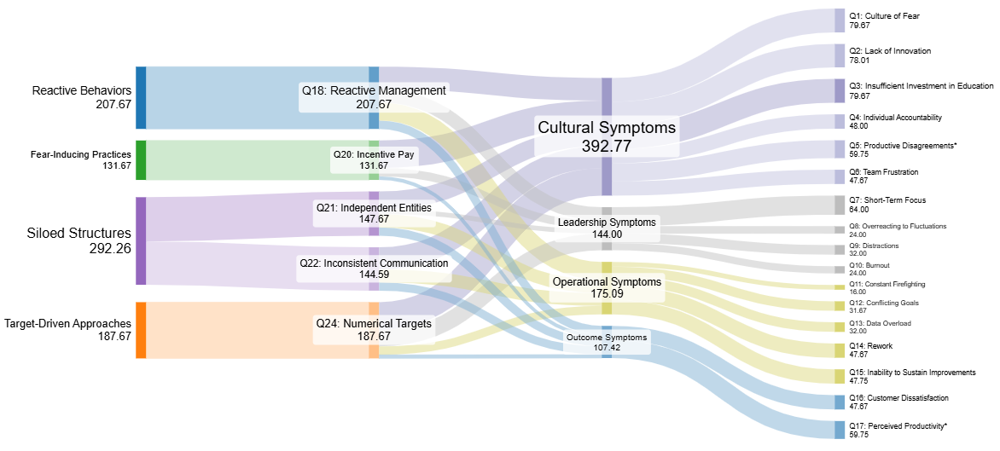

# Sankeymatic Script Generator

This application is designed to convert an input Excel file containing two-dimensional survey data, ie. where one set of questions correlates to another, into a Sankey diagram using the [Sankeymatic](https://sankeymatic.com/) web app.



## Quickstart: Just the Diagrams, Thanks
Download either the [All Practices](scripts/sankeymatic_all_practices_work_file.txt) or [Top Practices](scripts/sankeymatic_top_practices_work_file.txt) Sankeymatic work files and load them into the [builder UI](https://sankeymatic.com/build/) directly. These contain the corresponding scripts that were generated by sankey_generator.py along with UI and display setting enhancements to save you fine art of fiddling to get the diagrams to display as intended.

## Basic User Guide

To generate a Sankeymatic script using the included Excel file, at the command line enter
```
python sankey_generator.py [option flag]
```
and substitute in the following flags to create different diagrams:
* ```[no flag]``` With no flag specified, you'll get an all-up Sankey diagram visualizing all correlations in the Excel file, great for sanity-checking the correlation strength matrix in the Excel file.
* ```--allpractices``` Shows a Sankey diagram that correlates all *Faulty Practices* with observed *Symptoms*, aggregated under categories.
* ```--toppractices``` Shows a Sankey diagram that correlates only the top-5 *Faulty Practices* with observed *Symptoms*, aggregated under categories.

Results are output to a text file, ```sankeymatic_output.txt``` in the same folder the generator is run within.
